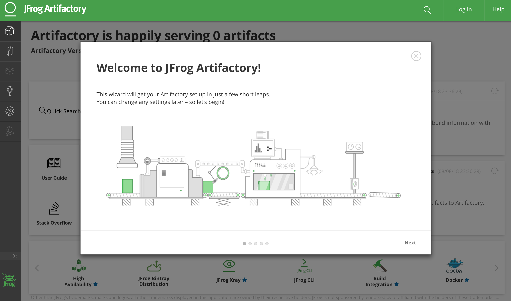
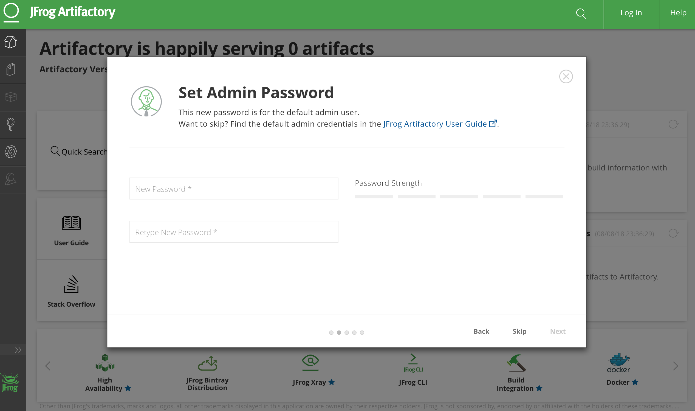
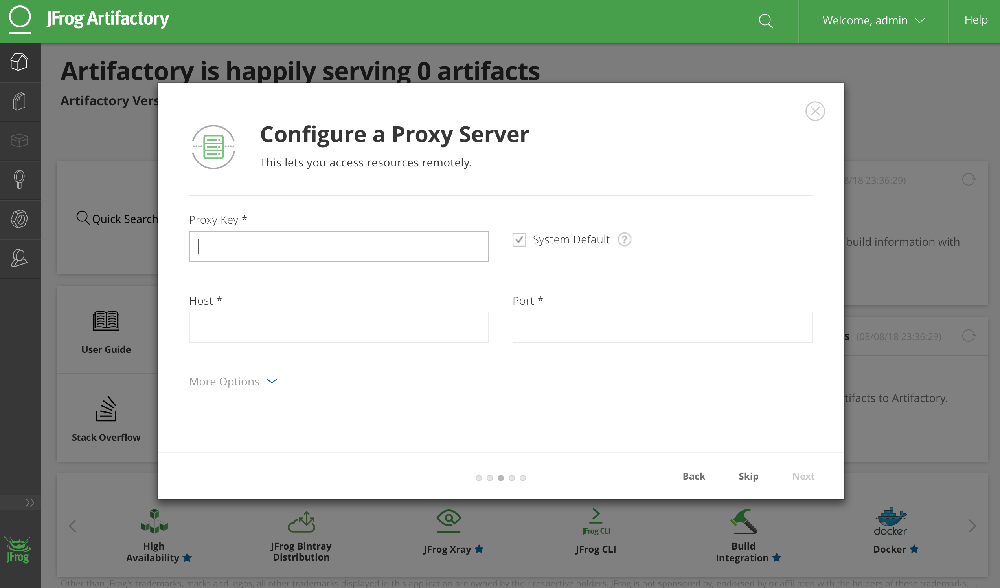
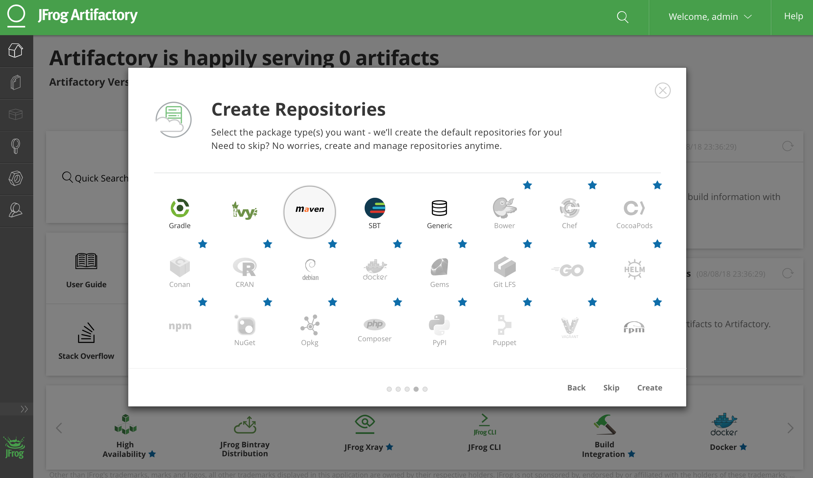
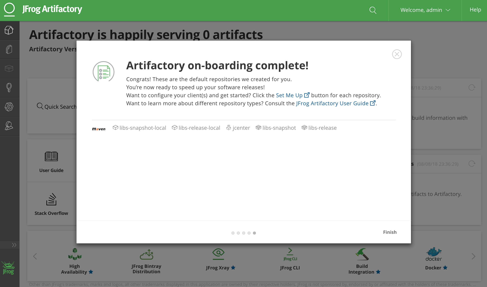

//tag::content[]

=== artifactory-maven-repo-gradle-example

.bootstrap artifactory (docker)
[source,bash]
----
docker run --name artifactory -d -p 80:8081 -v $(pwd)/artifactory:/var/opt/jfrog/artifactory docker.bintray.io/jfrog/artifactory-oss:6.1.0
----

configure artifactory

skip password configuration

skip proxy configuration

create maven default repository

we interested in 'libs-release-local' and 'libs-snapshot-local'

.configure gradle project properties
[source,properties]
----
include::./gradle.properties[tags=content]
----

.file: `build.gradle`
[source,gradle]
----
include::./build.gradle[tags=content]
----

.file: `gradle/artifactory.gradle`
[source,gradle]
----
include::./gradle/artifactory.gradle[tags=content]
----

.publish artifacts to artifactory
[source,bash]
----
./gradlew assemble artifactoryPublish
----

//Initially generated by using link:https://github.com/daggerok/generator-jvm/[generator-jvm] yeoman generator (java)

//end::content[]
